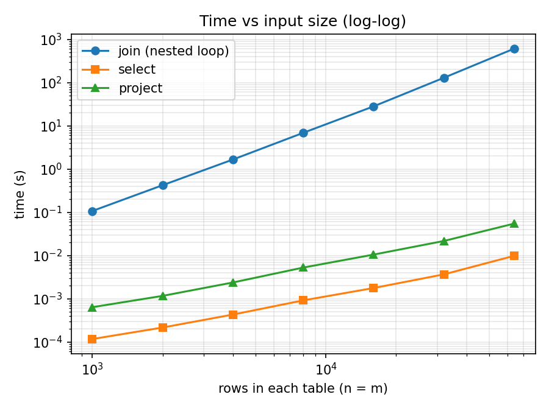

# Performance study

<!--
HOW TO FILL THIS IN
1. On your own machine, run:   python3 bench.py      (full run: about 10–20 minutes)
2. Every number below comes from results/tables.md, results/*.csv or results/machine.txt.
   Replace each «…» with the value from those files. Don't type a number you can't point to.
3. Put results/loglog.png in the repo, since it is embedded below.
4. Reread each answer and change the wording to match what YOUR numbers show.
-->

**Machine:** «2020 MacBook Pro M1, «8GB RAM»
**OS:** «results/machine.txt → platform»
**Language:** CPython «results/machine.txt → python»
**Command:** `python3 bench.py` (data from `gen_data.py`, match rate 1, seed 42)

## Instrumentation (8.2)

* **Join counter** (`JoinOp.execute` in `ra_engine/operators.py`). It adds 1
  inside the inner loop, before the condition is evaluated, so it counts
  every pair the condition is evaluated on, match or not.
* **Select counter** (`SelectOp.execute`). It adds 1 for every input tuple
  the condition is evaluated on.

`ra.py --stats` prints both after a query runs. Wall time is measured with
`time.perf_counter()` around `execute()` only, so it excludes loading,
parsing and planning. Up to n = 16000 each join is run 3 times and the
median is reported. At 32000 and 64000 each join is run once because it takes
minutes. Select and project use the median of 5 runs.

## Results (8.3): `R join[R.b=S.b] S`

| n | m | comparisons | wall time (s) | output tuples |
|---|---|---|---|---|
| 1000 | 1000 | « » | « » | « » |
| 2000 | 2000 | « » | « » | « » |
| 4000 | 4000 | « » | « » | « » |
| 8000 | 8000 | « » | « » | « » |
| 16000 | 16000 | « » | « » | « » |
| 32000 | 32000 | « » | « » | « » |
| 64000 | 64000 | « » | « » | « » |



## Answers (8.4)

### 1. The relationship between n, m and the comparison count

**comparisons = n × m, exactly.** The join is a nested loop: for each of the
n tuples of R, it walks all m tuples of S and evaluates the condition once
per pair. It never stops early, because a pair's match can't be known without
comparing it. The measured counts are 1000² = 1,000,000 up to
64000² = 4,096,000,000 «check this against the table: every row should equal n·m exactly».
There is no discrepancy, because the counter is incremented inside the inner
loop (it is counted, not computed from n and m).

(The formula only holds for these inputs because R and S are already sets.
If the inputs had duplicates, they would collapse when loaded, and n and m
would be the sizes *after* deduplication.)

### 2. Log-log slope of time against n

The least-squares slope of log(time) against log(n) is **«slope from
tables.md»** (computed in `bench.py: slope()`). A slope of s on a log-log plot
means time ∝ nˢ. Here n = m, so the work is n·m = n², and the prediction is a
slope of 2. The measured slope is ≈ 2, so wall time grows with the number of
comparisons: doubling n makes the join about 4× slower «quote two
neighbouring rows, e.g. 8000 → 16000: « » s → « » s, ratio « »». This is the
signature of a **quadratic nested-loop algorithm**. Each comparison costs
about the same (≈ «ns per comparison from tables.md» ns), and there are n²
of them.

### 3. `select` and `project` at the same sizes

| n | select evaluated | select time (s) | project time (s) |
|---|---|---|---|
| « copy from results/tables.md » | | | |

Both are **linear**. `select` evaluates the condition once per tuple
(counter = n exactly), and `project` builds one new tuple per input tuple and
looks it up once in the deduplication table. Their log-log slopes are about 1
(select « », project « »), compared with about 2 for the join. At n = 64000,
select takes « » s and the join takes « » s, a factor of about « ». The gap
itself grows linearly with n, because it is n² / n = n.

At small n, the select and project times are only tens of microseconds. There
the fixed costs (function calls, list allocation, timer resolution) are a
large share of the total, so the curves are noisier and their measured slope
can come out below 1.

`project` is slower than `select` at the same n, because it builds a new
tuple for every row and computes its equality key (`tuple_key`) for
deduplication. `select` only evaluates a comparison.

### 4. Predicting n = m = 1,000,000 (not run)

The join cost is proportional to n·m, so scale the largest measured run:

```
t(1,000,000) = t(64,000) × (1,000,000 / 64,000)²
             = « t64 » s × 244.14
             = « » s  ≈  « » hours
```

As a cross-check, use the cost per comparison: « t64 » s / 4.096 × 10⁹ =
« » ns per comparison. Multiplying by 10¹² comparisons gives the same « »
hours.

Assumptions: the cost per comparison stays constant, and the output (about
1,000,000 tuples at match rate 1) still fits in memory. Both held from
1000 to 64000 «point at the flat ns-per-comparison, if it is flat in your data».

### 5. Does the match rate change the comparison count? The wall time?

n = m = 2000, varying the match rate:

| match rate | comparisons | wall time (s) | output tuples |
|---|---|---|---|
| « copy from results/tables.md » | | | |

**The comparison count doesn't change.** It is 4,000,000 = 2000 × 2000 at
every match rate, because the nested loop compares every pair whether it
matches or not.

**The wall time does change, a little,** from « » s to « » s. Every matching
pair costs extra work: the join builds a new concatenated tuple (`l + r`) and
appends it to the output list. At match rate 500 there are 1,000,000 of these
allocations, compared with about 20 at rate 0.01. The two answers differ
because the counter measures work that is independent of the data (the
comparisons), while wall time also includes work that depends on the data
(producing output). The comparisons dominate, so the time moves only by
«x»%. «If some neighbouring rows go the "wrong" way, say that it is timer
noise and give the size of the noise.»

### 6. What it would take to make the million-tuple join feasible

The problem is the algorithm, not the language. Any nested loop does 10¹²
comparisons. For an equality condition like `R.b = S.b`, the fix is to stop
comparing every pair.

* A **hash join** builds a hash table on S.b (one pass over m tuples). It
  then probes the table once for each R tuple (one pass over n). The cost is
  O(n + m + output), about 2 × 10⁶ operations instead of 10¹². At the
  per-tuple costs measured for `project`, that is roughly « » seconds.
* A **sort-merge join**, O(n log n + m log m), or an **index nested-loop
  join** using a B⁺-tree on S.b would also work.

Any of these needs the planner to recognise that the join condition is an
equality between one column from each side, so the right algorithm can be
chosen. This is exactly what the later cost-model project adds. A faster
language or PyPy would only shrink the constant, perhaps 10–50×, which still
leaves hours for 10¹² comparisons.
